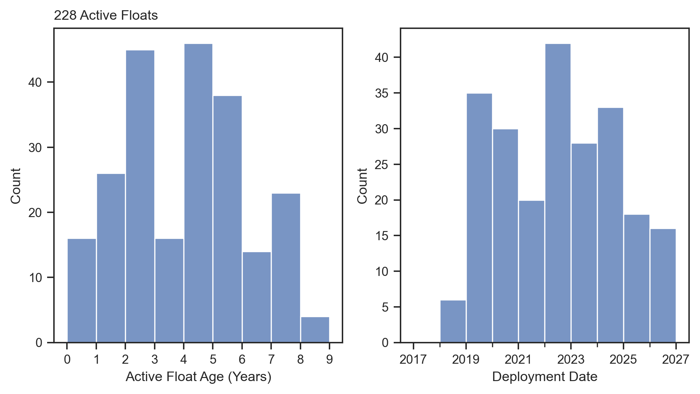
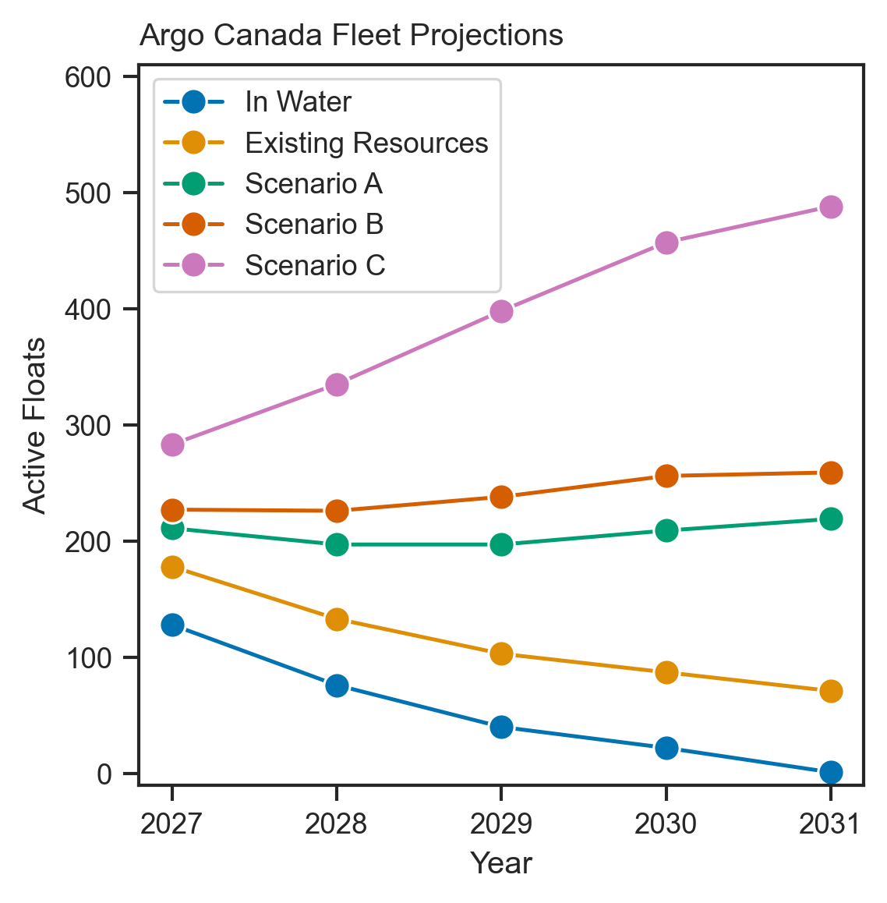
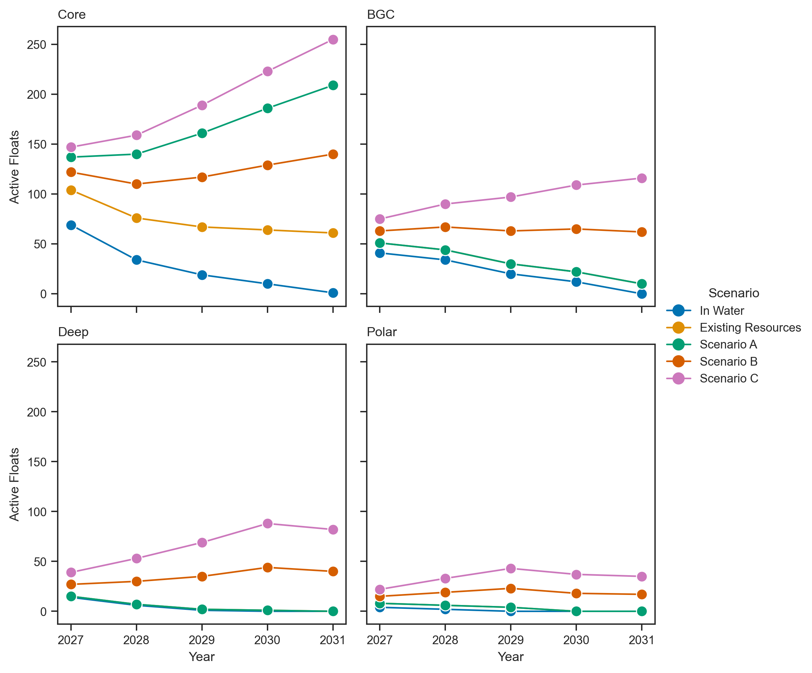

# Argo Canada Fleet Projections

Year over year active float projections based on float age, model, and various funding scenarios for Argo Canada.

## Float Types and Lifetime

All floats are categorized as Core, BGC, Deep, or Polar. BGC floats are defined as multi-parameter floats, and therefore do not include oxygen-only ARVORs which are counted in the Core category. While these oxygen floats are considered part of the BGC network of floats, their cost and lifetime is more in line with the Core float definition in this case.

Float lifetimes are defined based on type, and the lifetimes are used as a hard cut-off. Although many floats can exceed their expected lifetimes, many can also fail much before their nominal lifetime. This balance, and the simplicity of a hard cut-off, should leave us with a relatively accurate but conservative estimate of the fleet size. 

| Float Type | Lifetime (years) |
|------------|------------------|
| Core       | 5                |
| BGC        | 4.5              |
| Deep       | 3.5              |
| Polar      | 2.5              |

## Finances

Float estimates per year are based on funding scenarios and float cost. Float costs are estimated to increase at a rate of 5% per year, based on rough calculations from previous standing offers. The funding scenarios are:

| Scenario            | Description                                                                                                               |
|---------------------|---------------------------------------------------------------------------------------------------------------------------|
| In Water            | Floats already deployed in the water. No additional deployments simply shows attrition of the existing fleet based on age |
| Existing Resources  | Current actual funding                                                                                                    |
| Scenario A          | Increased funding for Core floats, still no funding for BGC, Deep, or Polar floats                                        |
| Scenario B          | Further increase in Core program funding, as well as funding for BGC, Deep, and Polar floats                              |
| Scenario C          | Further increase in funding across all categories of floats                                                               |

All scenarios except for "In Water" account for floats that are already procured but not yet in the water (28 Core floats, 4 Polar, 10 BGC, 1 Deep). These floats are all projected as deployed in 2027. For simplicity, any floats procured in a given year are also considered to be deployed in that year. 

## Current Fleet Status

The distribution of the age of active floats (_note: "active" in this case means they have reported a profile in the last year, as a simple way to get recent floats without excluding floats that may be under ice and thus maybe have not reported in recent months_) is shown in the left panel below, alongside the deployment date of active floats. The Argo Canada fleet is aging, but also shows that many floats out-perform the linetimes prescribed above. 

_Figure 1: Argo Canada float age (left) and deployment date (right)._

## Projections

Projections start by removing floats above their cut-off ages from the active floats above (totalling 83 floats). Then, in each year, projections of float procurement and deployment are made based on the funding scenario. Ages of existing floats are calculated on January 1st of each year, and floats that have aged out are removed. Similarly, floats with age limits shorter than the 5-year projection (all but core) period experience attrition over the years. 

A projection of the total number of floats in the Argo Canada fleet is shown below. 

_Figure 2: Total floats over the next 5 years for each funding scenario._

The number of floats by float type is shown in figure 3. 

_Figure 3: Number of floats of each type for each funding scenario. Note that for all types except core, there is no funding for purchase of any floats in "Existing Resources" or "Scenario A", so those two lines lie perfectly on top of one another, hiding the "Existing Resrouces" line._